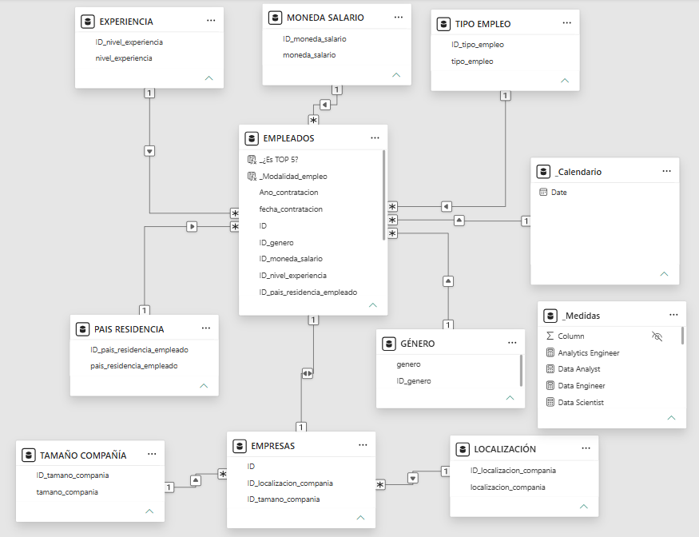
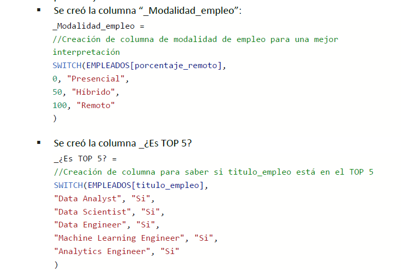
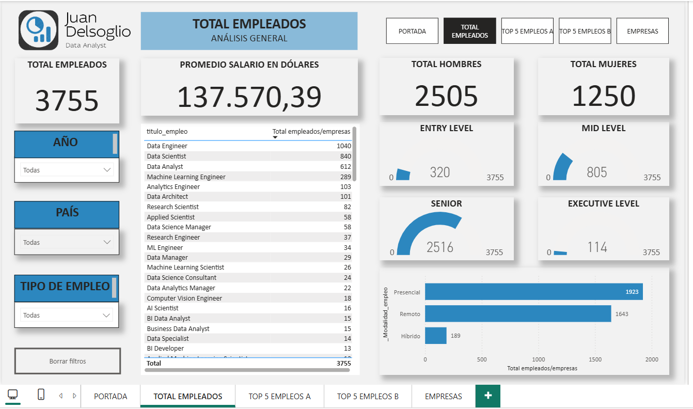
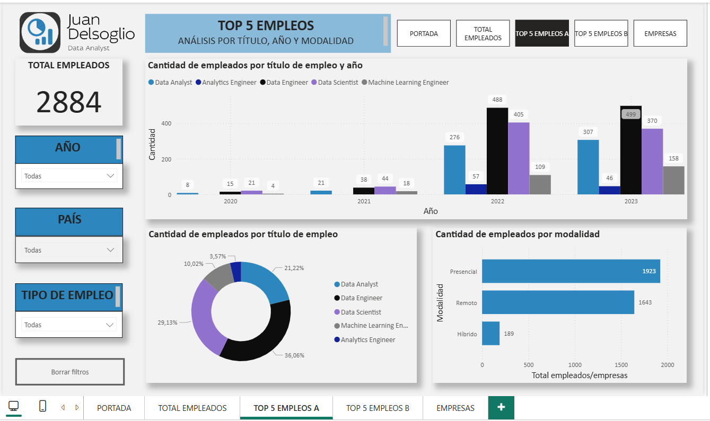

# Data Science Jobs Market — End-to-End Power BI Project

## Project Description
This repository contains a full Business Intelligence project analyzing a dataset of 3,755 data science professionals worldwide. The project covers the entire data lifecycle: from raw data processing and structural database normalization to custom data modeling (Star Schema), advanced analytics using DAX, and a professional 5-page interactive dashboard.

---

## Project Documentation & Report
A comprehensive 18-page technical report was developed for this project. It outlines the initial business hypotheses, strategic objectives, data dictionary definitions, data architecture diagrams, and the UI/UX visual design principles applied throughout the dashboard. 

The full documentation is available in this repository as:
* `Data_Science_Jobs_Market_Documentation.pdf`

---

## Data Architecture & Normalization
The original flat dataset was denormalized and structured into a relational model consisting of **9 interconnected tables** to optimize performance, eliminate redundant data, and ensure seamless information tracing:
* **Fact Table:** `EMPLEADOS` (Contains 12 attributes including composite foreign keys, core metrics, and hiring timestamps).
* **Dimension Tables:** `EMPRESAS`, `GÉNERO`, `EXPERIENCIA`, `TIPO EMPLEO`, `MONEDA SALARIO`, `PAÍS RESIDENCIA`, `LOCALIZACIÓN`, and `TAMAÑO COMPAÑÍA`.
* **Time Intelligence:** Integrated a custom corporate `_Calendario` table to track time-based trends natively[cite: 3].

### Relational Model (Star Schema) in Power BI:

---

## Advanced Analytics & DAX Implementation
Over 15 custom DAX measures and advanced conditional columns were developed for strategic reporting, utilizing functions like `CALCULATE`, `SWITCH`, `AVERAGE`, and `COUNT`[cite: 3]. 

### Key DAX Engineering Features:
* **Dynamic Segments:** Created custom job filters (`_¿Es TOP 5?`) to isolate core industry roles representing 76.8% of market volume[cite: 3].
* **Workplace Categorization:** Normalized remote percentage indicators into descriptive operational profiles (`Presencial`, `Híbrido`, `Remoto`)[cite: 3].

### Technical Code & Formulas Preview:

---

## Interactive Dashboard UI/UX
The dashboard was built following modern interface rules, implementing intuitive button navigation, unified branding colors (`#2C87BF`, `#262626`), and metric monitors tailored for decision-makers[cite: 3].

### 1. Global Fleet Analytics (Executive Summary)
Tracks primary market markers like total records (3,755), overall salary averages ($137,570.39 USD), gender distribution, and seniority gauges[cite: 3].

### 2. Deep-Dive Role Trends & Workplace Modalities
Analyzes year-over-year hiring acceleration from 2020 to 2023, confirming sector growth and tracking remote vs. on-site ratios for top positions[cite: 3].

---

## Repository Contents
* `Data_Science_Jobs_Market_Documentation.pdf`: Full technical project report and documentation (including business hypotheses, data dictionary, and methodology)[cite: 3].
* `Data_Science_Jobs_Market.pbix`: The source Power BI file containing queries, relationships, and visual pages[cite: 3].
* `dashboard_overview.png`: Executive dashboard summary view[cite: 3].
* `top_roles_analysis.png`: Role and modality trend analytical view[cite: 3].
* `data_model_star_schema.png`: Relational star schema diagram layout[cite: 3].
* `dax_formulas_preview.png`: Snippet of technical calculations and DAX measures[cite: 3].

## Source Dataset
Data obtained from Kaggle (Global Data Science Salaries Public Records)[cite: 3].
